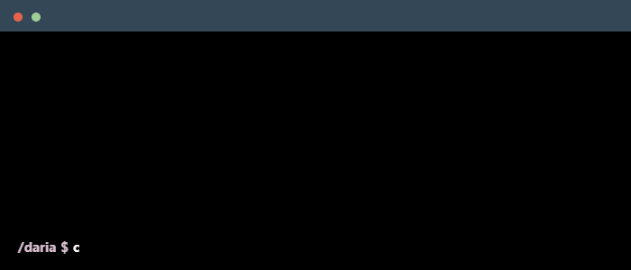

<!--
    Hey there, I'm Vaibhav Verma!
    Happy to see you here exploring my GitHub profile.
    Feel free to look around and star any repositories you find interesting!
    
    Don't forget to connect with me on LinkedIn and check out my projects below :))
-->

 

  

<!--
    Tip: You can generate your own animated Terminal GIF at https://www.terminalgif.com
    and save it in your repository under: ./assets/about_vaibhav.gif
-->

    

---

### 👨‍💻 About Me
- 🎓 **B.Tech Student** at **Dr. B.R. Ambedkar National Institute of Technology, Jalandhar** (NIT Jalandhar) *(2023 – 2027)*
- 💼 **Ex-SDE Intern** at **Utkrushta AI** | Core Full Stack Developer at **XCEED NITJ**
- 🚀 Experienced in architecting **distributed MERN platforms**, microservices on **GCP & Docker**, and asynchronous event-driven pipelines
- 🧠 Active contributor to **Agentic AI** & open source (LangChain, LangGraph orchestration)
- 🏆 Solved **500+ DSA problems** across LeetCode, CodeChef, and Codeforces

---

### 🛠️ Tech Stack & Skills

#### Languages & Core Technologies

#### Frameworks & Databases

#### Cloud, DevOps & Tools

### 🔭 Currently Exploring & Building With

- **Generative & Agentic AI:** LangChain, Pinecone vector indexing, Hugging Face models, Multi-turn RAG pipelines

---

### 🏆 Coding Profiles & Achievements

  
  
  

- **GSSoC 2026 Contributor:** Selected for Open Source and Agentic AI Tracks
- **Microsoft & LinkedIn Certified:** Generative AI Fundamentals
- **Competitive Programming:** LeetCode Rating 1460+ | CodeChef 3★ (Max 1750) | Codeforces (Max 1267)

---

### 🌐 Connect with Me

    
    
    

<!--
     Recruiters & Opportunities
-->

### 💼 Open to Opportunities?
> [!IMPORTANT]  
> 📄 **Looking for Software Development / Full Stack Engineering roles & internships!**  
> 📥 <a href="https://drive.google.com/file/d/11TE0IYX5FmH8VYNFqBNWWR1sbaozgMN9/view?usp=sharing" target="_blank">**Download / View My Resume**</a>

